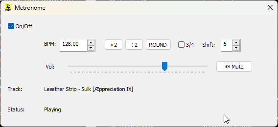
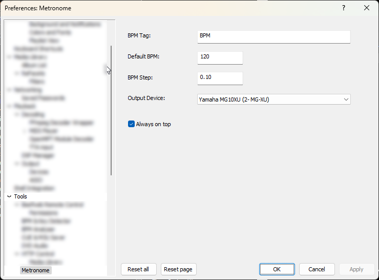

# 🎵 Metronome for foobar2000

### 🖼 Screenshots

| Main Window | Preferences |
| :---: | :---: |
|  |  |

---

## 🇬🇧 English

### Description

A metronome component for foobar2000 that synchronizes with playback. It automatically reads BPM from the **BPM & Key Detector** window (if open), then from the track's tags, or uses a default value. Includes a clean UI with controls for volume, time signature (3/4), shift offset, and quick BPM operations (×2, ÷2, ROUND).

### Features

- 🎵 **Sync with playback** – starts/stops with the player
- 🎯 **Auto BPM detection** – reads from BPM & Key Detector → tags → default
- 🔊 **Volume control** – separate volume slider for the metronome
- 🎼 **Time signature** – switch between 4/4 and 3/4
- ⏱️ **Shift offset** – delay the metronome by 1/16 increments
- 🔢 **Quick BPM ops** – ×2, ÷2, ROUND buttons
- 📂 **Context menu** – open from right-click on any track

### Settings

**Preferences → Tools → Metronome**

| Setting | Description |
|---------|-------------|
| **BPM Tag** | Tag name to read BPM from |
| **Default BPM** | Fallback value |
| **Output Device** | Audio device for metronome |
| **Always on top** | Keep window always on top |

### Context Menu

Right-click any track in the playlist → **Metronome**

If the window is already open, it will be brought to the foreground and updated with the selected track's BPM.

### Known Issues

- **ASIO devices** – may not work due to exclusive mode; use WASAPI or Default device
- **BPM & Key Detector** – component must be installed, window must be open and visible for detection to work

## Patch v1.0.1

- Fixed dark theme in the preferences page

---

## 🇷🇺 Русский

### Описание
Компонент-метроном для foobar2000, синхронизирующийся с воспроизведением. Автоматически считывает BPM из окна BPM & Key Detector (если открыто), затем из тегов трека, или использует значение по умолчанию. Включает удобный интерфейс с регулировкой громкости, размера такта (3/4), сдвигом и быстрыми операциями с BPM (×2, ÷2, ROUND).

### Возможности
- 🎵 Синхронизация с воспроизведением – запускается/останавливается вместе с плеером
- 🎯 Автоопределение BPM – читает из BPM & Key Detector → тегов → значения по умолчанию
- 🔊 Регулировка громкости – отдельный слайдер для метронома
- 🎼 Размер такта – переключение между 4/4 и 3/4
- ⏱️ Сдвиг – задержка метронома с шагом 1/16
- 🔢 Быстрые операции – кнопки ×2, ÷2, ROUND
- 📂 Контекстное меню – открытие по правому клику на треке

### Настройки

**Preferences → Tools → Metronome**

| Настройка |   Описание  |
|-----------|-------------|
| **BPM Tag** | Тег BPM - Имя тега для чтения BPM
| **Default BPM** | BPM по умолчанию - Значение по умолчанию
| **Output Device** | Устройство вывода - Аудиоустройство для метронома
| **Always on top** | Поверх всех окон - Окно всегда поверх других

### Контекстное меню

По правому клику на любом треке в плейлисте → **Metronome**

Если окно уже открыто, оно будет показано и обновлено с BPM выбранного трека.

### Известные проблемы

- **ASIO devices** – могут не работать из-за эксклюзивного режима; используйте WASAPI или устройство по умолчанию
- **BPM & Key Detector** – компонент должен быть установлен, окно должно быть открыто и видимо для работы определения

## Patch v1.0.1

- Исправлена тёмная тема на странице настроек

---

### 📝 License
Distributed under the MIT License. See `LICENSE` for more information.

